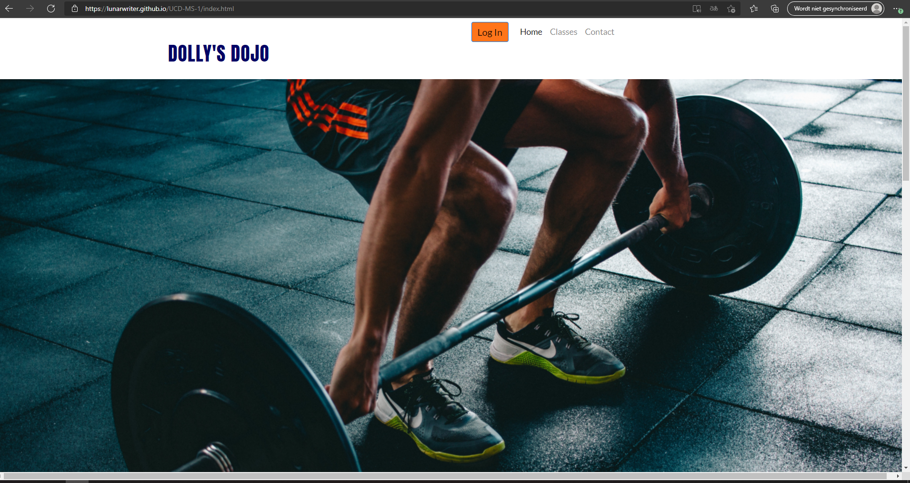
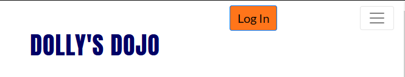
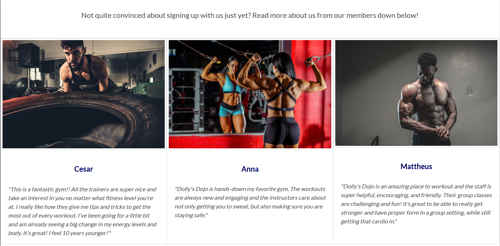
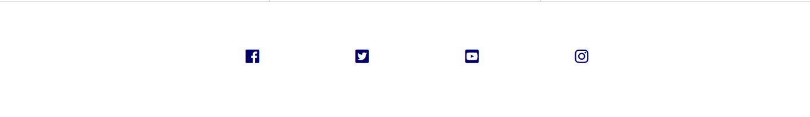
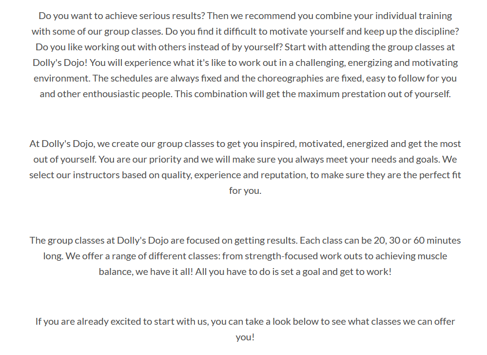
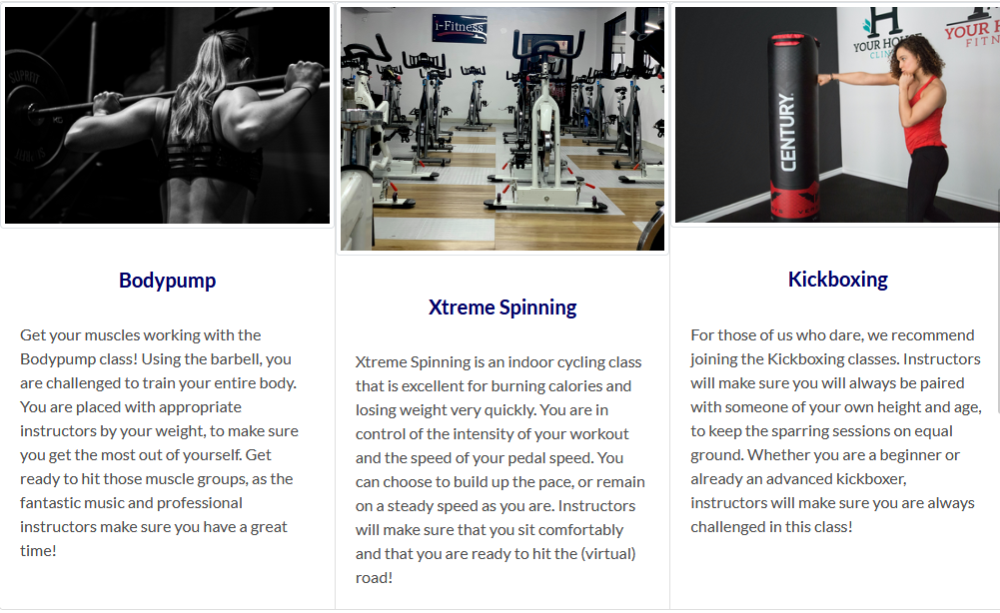
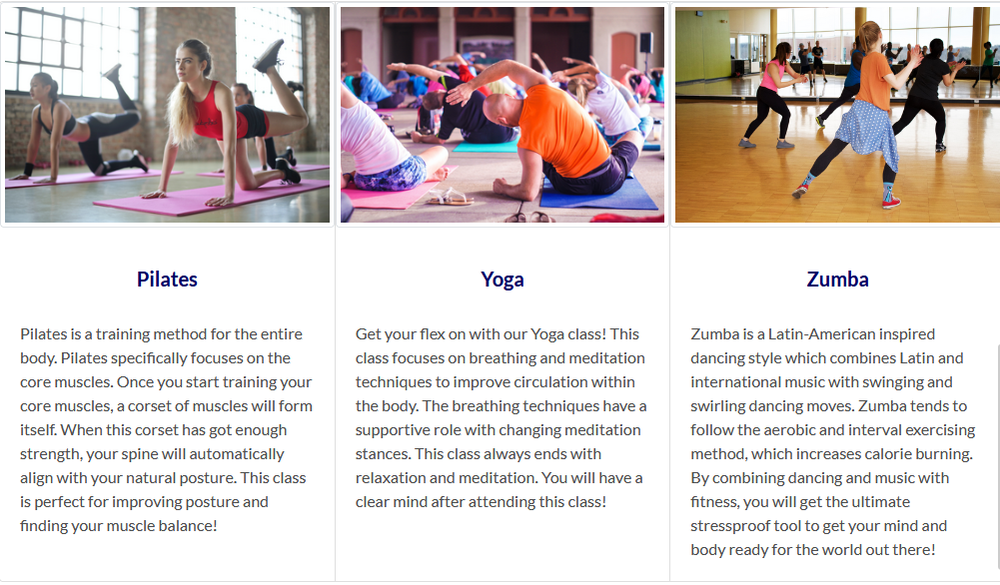
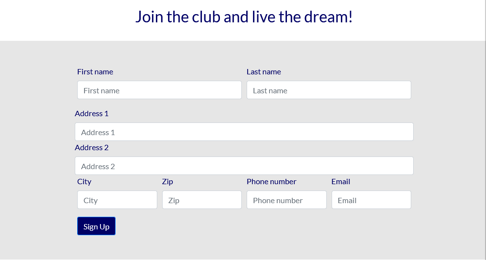
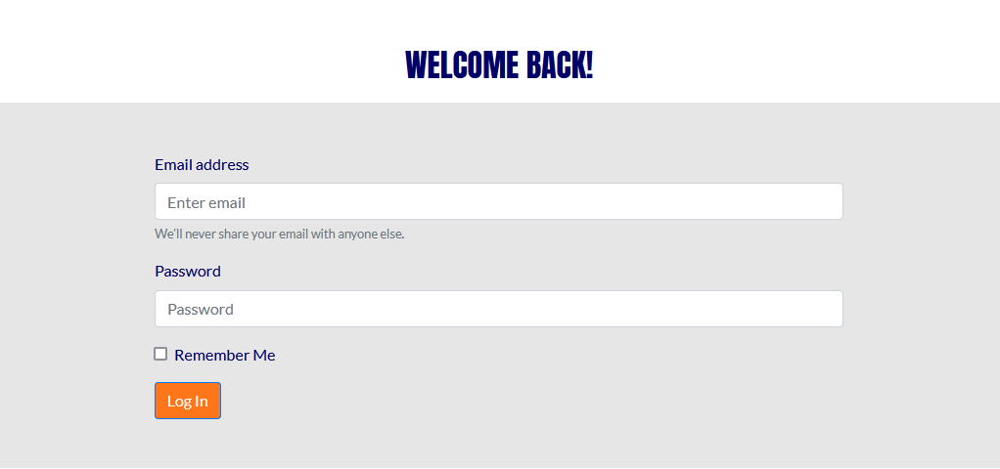

# __Dolly's Dojo__

## Code Institute Milestone Project 1

<a href = "https://lunarwriter.github.io/UCD-MS-1/index.html" rel="nofollow"> View the live project here</a>

This is the website for Dolly's Dojo. 
Dolly's Dojo is a website that is designed for people who are interested in trying out a new, exciting gym that has the resources for both individual workouts and a range of motivating group classes. 
Existing members that are already familiar with the procedures can log in and keep their fitness journey up to date.

<h2 align="center">

</h2>

 

## User Experience (UX)
---

 

* ### User Stories

    * __First Time Visitor Goals__

        1. As a First Time Visitor, I want to be able to navigate through the website with ease to find the content.
        2. As a First Time Visitor, I want to understand the main purpose of the website and learn more about the gym and its message.
        3. As a First Time Visitor, I want to know what other people’s previous experiences are of attending this gym and to easily find social links to keep up to date with news about the gym.

    * __Returning Visitor Goals__

        1. As a Returning Visitor, I want to find information about the gym classes and schedules.
        2. As a Returning Visitor, I want to be able to contact the gym easily and in the best way possible.
        3. As a Returning Visitor, I want to be able to easily log in to my account.

 

* ### Design

    * __Colour Scheme__

        * The main colours used are dark navy blue, slate gray, and white.

    * __Typography__

        * The two main fonts used for the website are Anton and Lato. Anton has a distinctively energetic character and stands out, which is fitting for a website about a gym. The Lato font is very clean and widely used among programmers, so it is very fitting as well as attractive.

    * __Imagery__

        * The imagery is essential. The large hero image on the homepage is designed to appear both eye-catching, motivating and purposeful.

 

## Features
---
__Existing Features__

* __Navigation Bar__

    * Featured on all three pages, the full responsive navigation bar includes links to the Home page, Classes, Contact Log In page and is identical in each page to allow for easy navigation.
    * This section will allow the user to easily navigate from page to page.
    * The navigation bar will turn into a toggler when the device is the size of a tablet or smaller.
        This will make it easier for users to navigate through the page, as well as visually more attractive on smaller devices.

<h2 align="center">

</h2>
<h2 align="center">

</h2>

 

* __The Hero Image__

    * The Hero image includes a photo with a text overlay to provide the user with some extra motivation.
    * The Hero image section introduces the user to Dolly's Dojo with an energetic, motivating image to get their attention.

<h2 align="center">

</h2>

 

* __User Review Section__

    * In the User Review section, the user will find the reviews of members who are frequent attenders of the gym and what they have experienced of Dolly's Dojo so far. 
    * The positive tones of the reviews will make the user awaken their own enthousiasm and courage to give Dolly's Dojo a try.

<h2 align="center">

</h2>

 

* __The Footer__

    * The footer section includes links to the relevant social media sites for Dolly's Dojo. The links will open to a new tab to allow easy navigation for the user.
    * The footer is valuable to the user as it encourages them to keep connected via social media

<h2 align="center">

</h2>

 

* __Classes Page__

    * The Classes page will show the user what different classes Dolly's Dojo has to offer.
    * This way, the user can get a preview even before attending the gym itself. 
        It will give the user some inside information, which will help them encourage to join the gym.

<h2 align="center">

</h2>

<h2 align="center">

</h2>

<h2 align="center">

</h2>

 

* __Contact Page__

    * In the Contact Page, users can get in touch with Dolly's Dojo by filling out the contact form.
    * Users also have the oppportunity to sign up for the gym and become a member.

<h2 align="center">

</h2>

 

* __Login Page__

    * The Login page exists for users who are already members of Dolly's Dojo. By clicking on the orange button in the navigation bar, they will be directed to this page.
    Once they filled out their information, they will be redirected to the home page.

<h2 align="center">

</h2>

 

 __Possible Future Features__

* The website could be improved by adding a feature for a webshop for Dolly's Dojo products. 
By adding this feature, users can get appropriate and safe fitness gear to attend the gym, the group classes or gym at home if they wish.

* Another feature that could improve the website is adding online group classes.
By adding this feature, users can attend the gym from their own home and stay as fit as ever. The users could attend a virtual class with instructors giving live classes.

 

##  Technologies Used
---

### Languages Used

* [HTML5](http://en.wikipedia.org/wiki/html5 "HTML5")
* [CSS3](http://en.wikipedia.org/wiki/css3 "CSS3")

 

### Frameworks, Libraries and Programs Used
1. [Bootstrap 4.3:](https://getbootstrap.com/docs/4.3/getting-started/introduction/ "Bootstrap4.3")
    * Bootstrap was used to assist with responsiveness and styling of the website.
2. [Google Fonts:](http://fonts.google.com/ "GoogleFonts")
    * Google Fonts were used to import the "Anton" and "Lato" font into the style.css file. These are used throughout the entire site.
3. [Font Awesome:](http://fontawesome.com/ "Fontawesome")
    * Font Awesome was used on all pages throughout the website to add icons to add some aesthetic and UX attributes.
4. [jQuery:](http://jquery.com/ "jQuery")
    * jQuery came with Bootstrap to make sure the navbar was responsive and collapsible, using a navigation toggler.
5. [Git:](http://git-scm.com/ "Git")
    * Git was used for version control by utilizing the Gitpod terminal to commit to Git and Push to GitHub.
6. [GitHub:](http://github.com/ "GitHub")
    * GitHub is used to store the projects code after being pushed from Git.

 

## Testing
---
The W3C Markup Validator and W3C CSS Validator Services were used to validate every page of the project to ensure there were no syntax errors in the project.

* [W3C Markup Validator](https://validator.w3.org/ "markup-validator") - [Results](https://validator.w3.org/nu/#textarea "markup-validator-results")
* [W3C CSS Validator](https://jigsaw.w3.org/css-validator/#validate_by_input "css-validator") - [Results](https://jigsaw.w3.org/css-validator/validator "css-validator-results")

