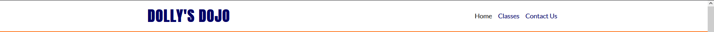
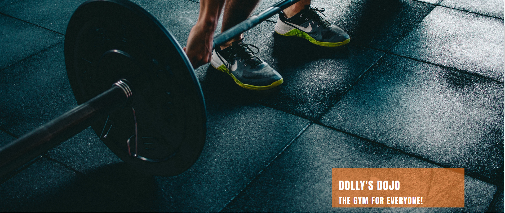
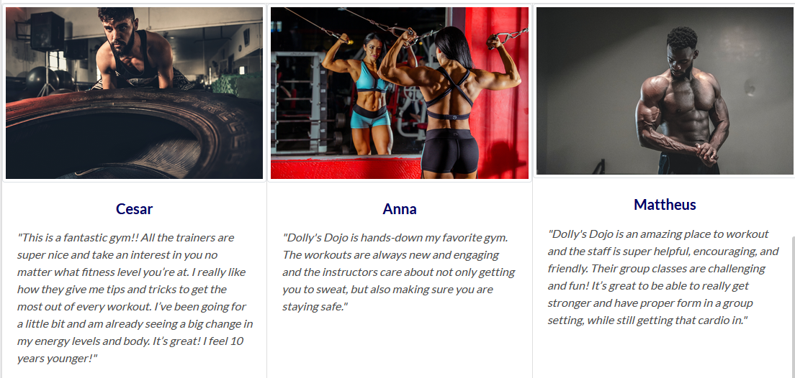
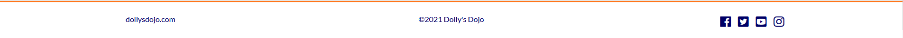
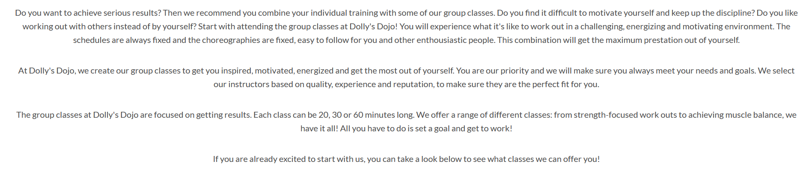
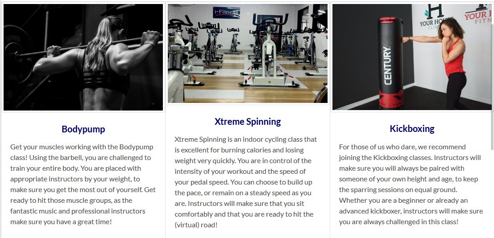
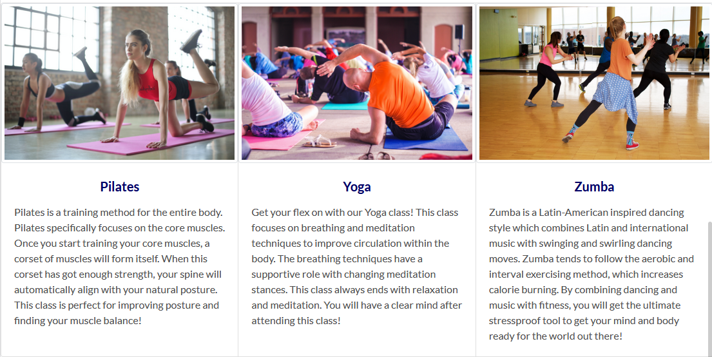
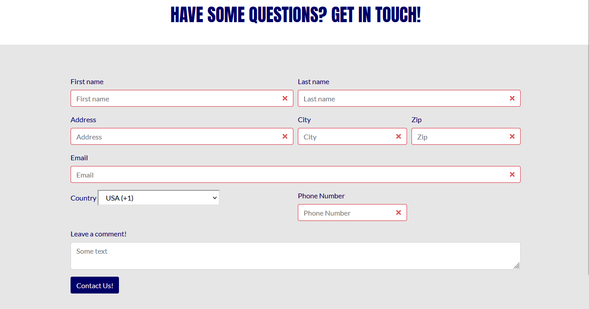

# __Dolly's Dojo__

## Code Institute Milestone Project 1

<a href = "https://lunarwriter.github.io/UCD-MS-1/index.html" rel="nofollow"> View the live project here</a>

This is the website for Dolly's Dojo. 
Dolly's Dojo is a website that is designed for people who are interested in trying out a new, exciting gym that has the resources for both individual workouts and a range of motivating group classes. 
Existing members that are already familiar with the procedures can log in and keep their fitness journey up to date.

<h2 align="center">

</h2>

 

## User Experience (UX)

* ### User Stories

    * __First Time Visitor Goals__

        1. As a First Time Visitor, I want to be able to navigate through the website with ease to find the content.
        2. As a First Time Visitor, I want to understand the main purpose of the website and learn more about the gym and its message.
        3. As a First Time Visitor, I want to know what other people’s previous experiences are of attending this gym and to easily find social links to keep up to date with news about the gym.

    * __Returning Visitor Goals__

        1. As a Returning Visitor, I want to find information about the gym classes and schedules.
        2. As a Returning Visitor, I want to be able to contact the gym easily and in the best way possible.

* ### Design

    * __Colour Scheme__

        * The main colours used are dark navy blue, slate gray, and white.

    * __Typography__

        * The two main fonts used for the website are Anton and Lato. Anton has a distinctively energetic character and stands out, which is fitting for a website about a gym. The Lato font is very clean and widely used among programmers, so it is very fitting as well as attractive.

    * __Imagery__

        * The imagery is essential. The large hero image on the homepage is designed to appear both eye-catching, motivating and purposeful.

 

## Features

__Existing Features__

* __Navigation Bar__

    * Featured on all three pages, the full responsive navigation bar includes links to the Home page, Classes, Contact Log In page and is identical in each page to allow for easy navigation.
    * This section will allow the user to easily navigate from page to page.
    * The navigation bar will turn into a toggler when the device is the size of a tablet or smaller.
        This will make it easier for users to navigate through the page, as well as visually more attractive on smaller devices.

 

* __The Hero Image__

    * The Hero image includes a photo with a text overlay to provide the user with some extra motivation.
    * The Hero image section introduces the user to Dolly's Dojo with an energetic, motivating image to get their attention.

 

* __User Review Section__

    * In the User Review section, the user will find the reviews of members who are frequent attenders of the gym and what they have experienced of Dolly's Dojo so far. 
    * The positive tones of the reviews will make the user awaken their own enthousiasm and courage to give Dolly's Dojo a try.

 

* __The Footer__

    * The footer section includes links to the relevant social media sites for Dolly's Dojo. The links will open to a new tab to allow easy navigation for the user.
    * The footer is valuable to the user as it encourages them to keep connected via social media

 

* __Classes Page__

    * The Classes page will show the user what different classes Dolly's Dojo has to offer.
    * This way, the user can get a preview even before attending the gym itself. 
        It will give the user some inside information, which will help them encourage to join the gym.

 

* __Contact Page__

    * In the Contact Page, users can get in touch with Dolly's Dojo by filling out the contact form.
    * Users also have the oppportunity to sign up for the gym and become a member.

 

* __Login Page__

    * The Login page exists for users who are already members of Dolly's Dojo. By clicking on the orange button in the navigation bar, they will be directed to this page.
    Once they filled out their information, they will be redirected to the home page.

 

 __Possible Future Features__

* The website could be improved by adding a feature for a webshop for Dolly's Dojo products. 
By adding this feature, users can get appropriate and safe fitness gear to attend the gym, the group classes or gym at home if they wish.

* Another feature that could improve the website is adding online group classes.
By adding this feature, users can attend the gym from their own home and stay as fit as ever. The users could attend a virtual class with instructors giving live classes.

* A third feature for improvement is a login page for existing members to get access to their own account. 

 

## Wireframes

* [Home Page](https://github.com/lunarwriter/UCD-MS-1/blob/master/docs/wireframes/homepage-wireframe.PNG "homepage wireframe")
* [Classes Page](https://github.com/lunarwriter/UCD-MS-1/blob/master/docs/wireframes/classes-wireframe.PNG "classes wireframe")
* [Contact Us Page](https://github.com/lunarwriter/UCD-MS-1/blob/master/docs/wireframes/contact-page-wireframe.PNG "contact wireframe")
* [Mobile Wireframe](https://github.com/lunarwriter/UCD-MS-1/blob/master/docs/wireframes/mobile-wireframe.PNG "mobile wireframe")

 

##  Technologies Used

### Languages Used

* [HTML5](http://en.wikipedia.org/wiki/html5 "HTML5")
* [CSS3](http://en.wikipedia.org/wiki/css3 "CSS3")

 

### Devices and Screen Sizes

The website was extensively tested to make sure every aspect became responsive to the screen size of the devices.
The browsers that were used for testing are: Microsoft Edge, Google Chrome and Mozilla Firefox.

* Laptop with HiDPI screen: 1440x900
* iPad: 768x1024
* iPhone 6/7/8 Plus iOS 11: 414x736
* Samsung Galaxy S9/S9+: 360x740

 

### Frameworks, Libraries and Programs Used
1. [Bootstrap 4.3:](https://getbootstrap.com/docs/4.3/getting-started/introduction/ "Bootstrap4.3")
    * Bootstrap was used to assist with responsiveness and styling of the website.
2. [Google Fonts:](http://fonts.google.com/ "GoogleFonts")
    * Google Fonts were used to import the "Anton" and "Lato" font into the style.css file. These are used throughout the entire site.
3. [Font Awesome:](http://fontawesome.com/ "Fontawesome")
    * Font Awesome was used on all pages throughout the website to add icons to add some aesthetic and UX attributes.
4. [jQuery:](http://jquery.com/ "jQuery")
    * jQuery came with Bootstrap to make sure the navbar was responsive and collapsible, using a navigation toggler.
5. [Git:](http://git-scm.com/ "Git")
    * Git was used for version control by utilizing the Gitpod terminal to commit to Git and Push to GitHub.
6. [GitHub:](http://github.com/ "GitHub")
    * GitHub is used to store the projects code after being pushed from Git.
7. [Mockplus:](https://www.mockplus.com/ "Mockplus")
    * Mockplus was used to create the wireframes for the website.

 

## Testing

The W3C Markup Validator and W3C CSS Validator Services were used to validate every page of the project to ensure there were no syntax errors in the project.

* [W3C Markup Validator](https://validator.w3.org/ "markup-validator") - [Results](https://validator.w3.org/nu/#textarea "markup-validator-results")
* [W3C CSS Validator](https://jigsaw.w3.org/css-validator/#validate_by_input "css-validator") - [Results](https://jigsaw.w3.org/css-validator/validator "css-validator-results")

 

__Testing User Stories from User Experience (UX) Section__

* __First Time Visitor Goals__

    1. As a First Time Visitor, I want to be able to navigate through the website with ease to find the content.

        * The site has been designed to be fluid. The navigation bar is sticky, therefore it will scroll down along with the scrollbar as the user finds out more about the page. They will be able to get to the desired page within seconds, at any given moment.
        * On the Contact Us page, after the form is submitted, the user will find themselves on a new page with a message. The navigation bar is still present and they can get back to any page by clicking on the link.

    <h2 align="center">
    
    </h2>
    
    2. As a First Time Visitor, I want to understand the main purpose of the website and learn more about the gym and its message.

        * When entering the site, users are greeted with a clean and easily readable navigation bar to get to the page of their choice. Underneath the navigation bar users will find the hero image with a text overlay “Dolly’s Dojo – The gym for everyone!”.
        * The main purpose of the website is immediately found within the hero image and text overlay.
        * The user has to either scroll down the page to find out more about the website, or use the navigation bar and click on the pages they want to see.

    <h2 align="center">
    
    </h2>

    3. As a First Time Visitor, I want to know what other people’s previous experiences are of attending this gym and to easily find social links to keep up to date with news about the gym.

        * On the homepage, if users scroll down below the hero image, they will find a section with User Reviews. In this section, users can find out what people’s previous experiences with this gym are, and determine whether they would like to find out more.
        * On the right bottom of each page, the user will find some links for social media platforms that the gym is making use of.
        * The social media include Facebook, Instagram, Twitter and Youtube accounts for the gym.
        * The social links will open up in a new tab, so users can easily get back to the page for the gym.
    
    <h2 align="center">
    
    </h2>
    
    <h2 align="center">
    
    </h2>

 

* __Returning Visitor Goals__

    1. As a Returning Visitor, I want to find information about the gym classes and schedules.

        * If the user clicks on the Classes in the navigation bar, they will be directed to a page where the gym's group classes are viewed.
        * Users can find out more about the gym and the procedures for the classes.
        * If the user scroll down, they will find six images with the class names and information about the classes.

    <h2 align="center">
    
    </h2>

    <h2 align="center">
    
    </h2>

    <h2 align="center">
    
    </h2>

    2.  As a Returning Visitor, I want to be able to contact the gym easily and in the best way possible.

        * The navigation bar highlights the Contact Page.
        * On the Contact Page, users can fill out a form to get in touch with the gym. This way, they will have more direct communication with the creators of the gym and have more opportunity to get information.
        * On the bottom of each page, the user will find the footer bar where a website and the links for social platform accounts can be found. Users can also contact the gym by means of social media.

    <h2 align="center">
    
    </h2>

 

## Known Bugs

*   The dropdown menu for selecting the Country code in the Contact Page form does not reduce in size when the website is viewed on tablet-sized or mobile devices. 
    * As a result, the dropdown stretches out behind the field for Phone number.
*   When the website is viewed in Microsoft Edge, the social links in the footer only turn orange (hover colour) when clicked on.

 

## Deployment

__Running the website from GitPod__

1.	Log in to GitHub and locate the GitHub [Repository](https://github.com/lunarwriter/UCD-MS-1 "github pages repository")
2.	On the right of the Repository name, click on the green “GitPod” button.
3.	Log in to GitPod and open the workspace with the same name as the repository.
4.	In the second column from the left, select the file to open the project.
5.	In the terminal (below the console), type: `python3 -m http.server`
6.	A popup will appear for action on port 8000. Click on the blue button for “Make Public”.
7.	Click on the second blue button “Open Browser” to open a preview of the website.

 

__GitHub Pages__

The project was deployed to GitHub Pages using the following steps...

1. Log in to GitHub and locate the GitHub [Repository](https://github.com/lunarwriter/UCD-MS-1 "github pages repository")
2. At the top of the Repository (not top of page), locate the "Settings" Button on the menu. 
3. Scroll down the Settings page until you locate the "GitHub Pages" Section.
4. Under "Source", click the dropdown called "None" and select "Master Branch".
5. The page will automatically refresh.
6. Scroll back down through the page to locate the now published site [link](https://lunarwriter.github.io/UCD-MS-1/index.html "live project") in the "GitHub Pages" section.

 

__Forking the GitHub Repository__

1. Log in to GitHub and locate the GitHub [Repository](https://github.com/lunarwriter/UCD-MS-1 "github pages repository")
2. At the top of the Repository (not top of page) just above the "Settings" Button on the menu, locate the "Fork" Button.
3. You should now have a copy of the original repository in your GitHub account.

 

__Making a Local Clone__

1. Log in to GitHub and locate the GitHub [Repository](https://github.com/lunarwriter/UCD-MS-1 "github pages repository")
2. Under the repository name, click "Clone or download".
3. To clone the repository using HTTPS, under "Clone with HTTPS", copy the link.
4. Open Git Bash.
5. Change the current working directory to the location where you want the cloned directory to be made.
6. Type `git clone`, and then paste the URL you copied in Step 3.
7. Press Enter. Your local clone will be created.

<h2 align="center">

</h2>

 

## Credits

__Code__

* The code structure for the project was inspired by the [Code Institute Mini Project: Love Running](https://github.com/Code-Institute-Solutions/Love-Running-Solutions "Love Running Mini Project") and the [Code Institute Mini Bootstrap Project](https://github.com/Code-Institute-Solutions/resume-miniproject-bootstrap4 "Mini Bootstrap Project") for aesthetic preferences.
* [Bootstrap 4.3:](https://getbootstrap.com/docs/4.3/getting-started/introduction/ "Bootstrap4.3") Bootstrap was used to make the site responsive using the Grid, Form, Navbar and Cards components, as well as making the button elements interactive.
* [GitHub](https://github.com/etjossem/country-codes-html/blob/master/_country_codes.html "Bootstrap4.3")
This page was used to create the dropdown menu for the country codes in the Contact Page form.
This way, users can select their countries and insert their respective phone numbers.

 

__Content__

* The text for the user reviews was taken from [Eatsleepwander](https://eatsleepwander.com/gym-review-example/ "user review text credits")
* The text and class names for the Classes page was taken from [Fitness365](https://fitness365.nl/locaties/amsterdam/groepslessen/ "classes page credits") translated from Dutch
* ReadMe structure and general content taken from [this sample](https://github.com/Code-Institute-Solutions/SampleREADME#user-experience-ux "readme1 credits") and [this sample](https://github.com/Code-Institute-Solutions/readme-template "readme2 credits")

 

__Media__

* The hero image and the user review images were taken from [Pexels](https://pexels.com/ "pexels credits")
* The images for the classes were taken from [Unsplash](https://unsplash.com/s/photos/ "unsplash credits")

